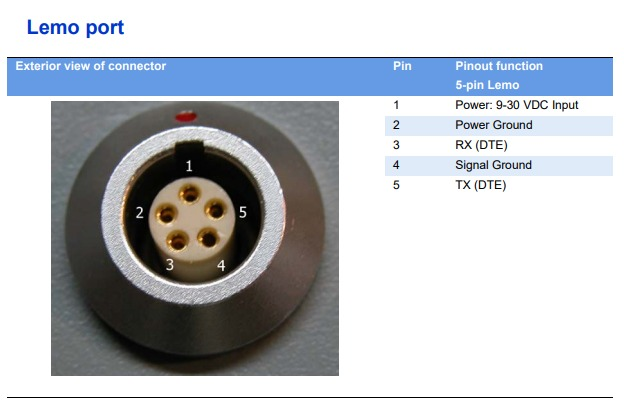
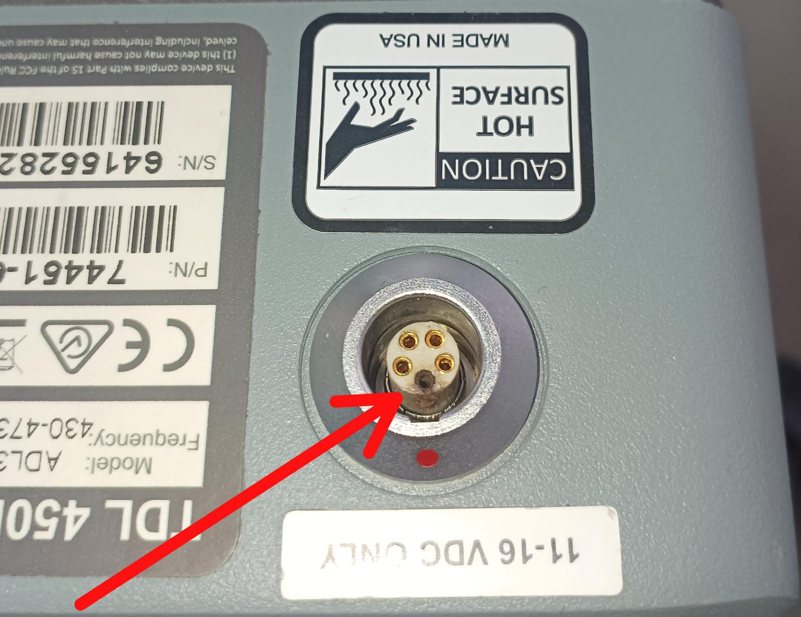

# Puerto LEMO 5 con pin superior quemado

---

## Descripción

Se ha observado en múltiples radios **Trimble TDL450H** la presencia de daño o quemaduras en el pin superior del conector **LEMO de 5 pines**.

En la mayoría de los casos este daño no impide el funcionamiento normal del equipo, aunque constituye un indicio de desgaste del conector y puede derivar en problemas de alimentación si continúa deteriorándose.

El objetivo de este documento es explicar la causa más probable de este daño y las medidas recomendadas para prevenirlo.

---

## Síntoma

Durante una inspección visual del conector LEMO de 5 pines es posible observar:

* Oscurecimiento del pin superior.
* Marcas de quemaduras o carbonización.
* Erosión del material del contacto.
* Decoloración localizada alrededor del pin.

---

## Causa

La **TDL450H** puede transmitir con una potencia de RF de hasta **35 W**. Durante la transmisión, el amplificador de potencia demanda una corriente elevada desde la fuente de alimentación.

Si el cable LEMO se desconecta mientras la radio continúa transmitiendo, la corriente que circula por la línea de alimentación puede producir un **arco eléctrico** cuando los contactos comienzan a separarse.

Este arco genera altas temperaturas durante un tiempo muy breve, erosionando progresivamente la superficie del contacto y produciendo el aspecto característico de un pin quemado.

Tras múltiples desconexiones bajo estas condiciones, el daño puede hacerse visible durante una inspección del conector.

Este mecanismo fue descrito por **Thomas Amspaugh** durante una capacitación técnica de Trimble, indicando que la desconexión del conector LEMO mientras la radio transmite puede provocar este tipo de daño debido al arco eléctrico generado sobre el contacto de alimentación.

---

## Diagnóstico

El daño corresponde al pin de alimentación (**POWER**) del conector LEMO.

### Pinout del conector LEMO

{ .center-img }

---

## Evidencia práctica

Ejemplo de un conector LEMO con el pin superior afectado por el fenómeno descrito.

{ .center-img }

---

## Recomendaciones

Para evitar este tipo de daño se recomienda:

* No desconectar el cable LEMO mientras la radio se encuentre transmitiendo.
* Detener la transmisión antes de retirar el conector.
* Esperar unos segundos después de finalizar la transmisión antes de desconectar el cable.
* Realizar inspecciones periódicas del estado de los contactos del conector durante mantenciones preventivas.

---

## Conclusión

El daño observado en el pin superior del conector LEMO de la **TDL450H** es consistente con el desgaste producido por arcos eléctricos generados al desconectar el equipo mientras circula una corriente elevada de alimentación durante la transmisión.

La evidencia observada en el laboratorio coincide con la explicación entregada durante la capacitación técnica de Trimble, reforzando la importancia de evitar la desconexión del equipo mientras se encuentra transmitiendo.

---

## Referencias

* Capacitación técnica impartida por **Thomas Amspaugh**.
* Observaciones realizadas en el laboratorio de servicio técnico de GEOCOM.