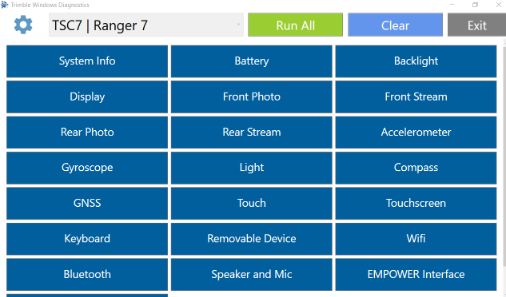

# Trimble Windows Diagnostics

Software de diagnóstico utilizado para verificar el correcto funcionamiento de los distintos subsistemas de los controladores **Trimble TSC7** y **Ranger 7**.

## Ejecución

Iniciar el software mediante:

```bat
TSC7 Diagnostics.bat
```

El archivo ejecuta el lanzador de diagnósticos utilizando la configuración correspondiente al TSC7:

```bat
.\twdcnsl.exe LOAD TWDConfig.xml "TSC7 | Ranger 7"
```

{ .center-img }

## Pruebas disponibles

| Prueba | Descripción |
|---------|-------------|
| Información del sistema | Muestra información del equipo, BIOS, CPU, RAM y almacenamiento. |
| Batería | Verifica el estado de carga y alimentación. |
| Cámara | Comprueba la transmisión de video y captura de imágenes. |
| Flash | Verifica el funcionamiento del flash LED. |
| Acelerómetro | Comprueba la respuesta del acelerómetro. |
| Brújula | Verifica el funcionamiento del magnetómetro. |
| Giroscopio | Comprueba la medición de velocidad angular. |
| Sensor de luz | Verifica el sensor de iluminación ambiental. |
| GNSS | Comprueba el posicionamiento GNSS. |
| Pantalla | Verifica la correcta visualización de colores. |
| Retroiluminación | Comprueba el control del brillo de la pantalla. |
| Pantalla táctil | Verifica el funcionamiento del panel táctil. |
| Lápiz EMR | Comprueba el funcionamiento del lápiz EMR. |
| Botones | Verifica los botones físicos del equipo. |
| Teclado | Comprueba el funcionamiento del teclado. |
| USB | Verifica la detección de dispositivos USB. |
| Bluetooth | Comprueba el funcionamiento del adaptador Bluetooth. |
| Wi-Fi | Verifica la detección de redes inalámbricas. |
| Parlante y micrófono | Comprueba reproducción y grabación de audio. |
| EMPOWER | Verifica la interfaz EMPOWER (Requiere modulo de prueba P/N: 119622-TL). |

## Requisitos

- Windows 10
- .NET Framework 4.6.1 o superior
- Hardware compatible (TSC7 / Ranger 7)
- Permisos de ejecución para los archivos del software

## Consideraciones

> Antes de ejecutar el software, verifique que **todos los archivos ejecutables (`.exe`)** se encuentren presentes en la carpeta de instalación. (Habilite visualizacion de archivos escondidos).
>
> Algunos antivirus (por ejemplo, **Kaspersky Endpoint Security**) pueden detectar falsos positivos y poner determinados ejecutables en cuarentena sin mostrar una notificación evidente, ocasionando que algunas pruebas fallen inmediatamente o no se inicien.

## Solución de problemas

### Una prueba falla inmediatamente

Verificar:

- Que el ejecutable correspondiente exista en la carpeta del software.
- Que el antivirus no haya puesto el archivo en cuarentena.
- Que todos los archivos del paquete hayan sido extraídos correctamente.

### Prueba de giroscopio

Por ejemplo, si la prueba de **Gyroscope** falla inmediatamente después de iniciarse:

1. Verificar que exista el archivo:

```
Gyrometer.exe
```

2. Si el archivo no está presente en el directorio, revisar la cuarentena del antivirus.

3. Restaurar el archivo y agregar una exclusión en el antivirus si corresponde.
